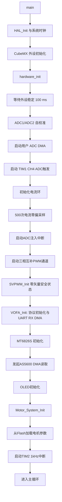
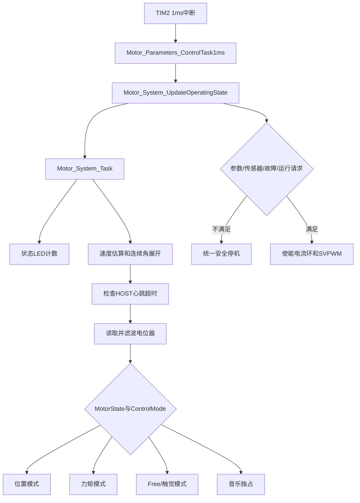
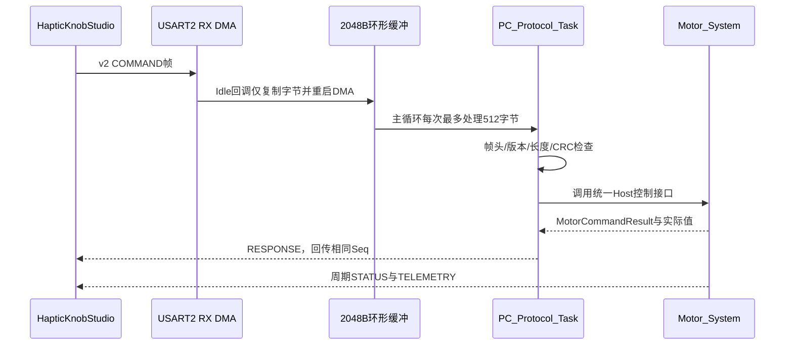
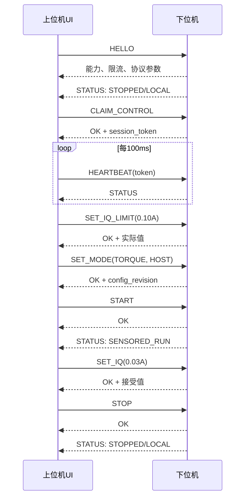

# G431 FOC 下位机功能、代码流程与上位机通信说明

版本：当前代码实现说明  
日期：2026-09-15  
适用工程：`D:/WorkDocument/g431_foc`  
配套上位机：`D:/WorkDocument/HapticKnobStudio`

> 本文描述当前源码已经实现的行为，用于读代码、联调和真机测试。尚未完成的能力会在“当前限制”中单独说明。

## 1. 系统概览

当前下位机运行在 STM32G431 上，主要完成：

- 三相无刷电机 FOC 电流闭环；
- AS5600 有感换相和机械速度估算；
- 电机参数加载、辨识与 Flash 保存；
- 位置、直接力矩和四种触觉模式；
- 电机音乐播放；
- 并行无感观测器；
- OLED 状态显示；
- USART2 与 HapticKnobStudio 双向通信；
- 上位机接管、命令确认、状态回报、遥测和失联停机。

控制系统分为三个时间层：

| 层级 | 执行位置 | 典型频率 | 主要工作 |
|---|---|---:|---|
| 快速电流层 | ADC 注入转换完成中断 | 约 20 kHz | 电流采样、Clarke/Park、Id/Iq PI、反Park、SVPWM |
| 系统控制层 | TIM2 周期中断 | 1 kHz | 状态机、速度估算、位置/力矩/触觉模式、心跳超时 |
| 后台服务层 | `main()` 主循环 | 尽快循环 | 编码器恢复、参数保存、串口协议解析、ACK/STATUS/遥测、OLED |

## 2. 当前硬件与基础配置

### 2.1 主要外设

| 外设 | 当前用途 |
|---|---|
| TIM1 | 三相互补 PWM，并触发 ADC 注入采样 |
| ADC1 | U/W 两相电流注入采样 |
| ADC2 | 用户电位器等普通 ADC DMA 采样 |
| TIM2 | 1 ms 系统控制任务 |
| I2C1 + DMA | AS5600 角度读取 |
| SPI1 | MT6826S 试验性读取，目前不进入实际换相链路 |
| USART2 + DMA | 上下位机双向通信，921600、8N1 |
| OLED | 故障、参数及辨识状态提示 |

### 2.2 电机与安全相关配置

配置集中在 `user/inc/motor_config.h`：

| 配置 | 当前值 | 含义 |
|---|---:|---|
| `SYSTEM_BUS_VOLTAGE` | 15.0 V | 算法使用的固定母线电压；硬件当前没有实时母线采样 |
| `MOTOR_TORQUE_CURRENT_LIMIT_A` | 1.5 A | 普通力矩给定的软件硬上限 |
| `MOTOR_HOST_DEFAULT_IQ_LIMIT_A` | 0.10 A | 上位机每次接管后的默认会话限流 |
| `MOTOR_HOST_HEARTBEAT_TIMEOUT_MS` | 500 ms | 上位机心跳丢失后的停机时间 |
| `MOTOR_IQ_SLEW_A_PER_S` | 1.0 A/s | HOST Iq 和触觉 Iq 的变化率限制 |
| `MOTOR_PARAMETERS_AUTO_IDENTIFY` | 0 | 参数缺失时不自动开始辨识 |
| `MOTOR_TORQUE_POT_MAX_CURRENT_A` | 0.2 A | 本地电位器力矩模式的最大电流 |
| `MOTOR_TORQUE_CONSTANT_NM_PER_A` | 8.27/291 | 根据 291 KV 估算的 Kt，不是实测值 |

下位机当前默认工作模式是 TORQUE，默认输入来源是 POT，但上电后 `run_requested=0`，因此不会自动开始出力。

## 3. 上电初始化流程

程序从 `Core/Src/main.c` 进入，CubeMX 先初始化 GPIO、DMA、ADC、TIM、I2C、USART 和 SPI，随后调用 `hardware_init()`。



需要注意：代码会启动 TIM1 的物理 PWM 通道，但 `SVPWM_Init()` 将输出置于安全零矢量状态；真正闭环输出还要经过系统状态机调用 `SVPWM_Enable()` 和 `Motor_CurrentLoop_Enable(1)`。

参数加载结果决定初始状态：

- Flash 参数有效：下一次状态更新进入 STOPPED，等待显式 START；
- Flash 无有效参数：进入 WAIT_PARAMETERS；因为自动辨识关闭，不会自行驱动电机辨识；
- 参数记录错误或后续辨识失败：进入 FAULT。

## 4. 主循环和中断关系

### 4.1 后台主循环

`main()` 中持续执行：

```text
AS5600_BackgroundTask()
Motor_Parameters_BackgroundTask()
PC_Protocol_Task()
Motor_ShowDebugInfo_OLED()
```

各函数职责：

- `AS5600_BackgroundTask()`：处理 I2C 读取失败后的恢复及下一次采样调度；
- `Motor_Parameters_BackgroundTask()`：参数辨识结束后的 Flash 保存等慢操作；
- `PC_Protocol_Task()`：从串口环形缓冲取数据、拆帧、CRC 校验、执行命令和发送周期 STATUS；
- `Motor_ShowDebugInfo_OLED()`：刷新 OLED，并每 5 ms 尝试发送一次 Studio v2 遥测。

串口解析、CRC、数据封包、OLED 和 Flash 操作均不放入 20 kHz 电流环。

### 4.2 1 kHz 系统任务

TIM2 每 1 ms 调用 `HAL_TIM_PeriodElapsedCallback()`：



### 4.3 约 20 kHz 电流环

TIM1 触发 ADC1 注入采样，转换完成后进入 `HAL_ADCEx_InjectedConvCpltCallback()`：

1. 读取 U/W 两相原始电流；
2. 对采样做一阶滤波；
3. 调用 `Motor_CurrentLoop_Run()`；
4. 在电流环内部完成电流重构、Clarke/Park 变换；
5. Id/Iq PI 计算目标电压；
6. 反 Park 得到 α/β 电压；
7. SVPWM 更新三相占空比。

1 kHz 系统层只生成 `target_d/target_q`，不会把串口和触觉界面逻辑塞入快速电流中断。

## 5. 电机系统状态机

`MotorState` 表示电机当前实际运行状态，与“选择了什么工作模式”是两件事。

| 值 | 状态 | 进入条件和行为 |
|---:|---|---|
| 0 | STOPPED | 参数有效、编码器有效，但没有运行请求；关闭电流环和SVPWM |
| 1 | WAIT_PARAMETERS | Flash 中没有可用电机参数；保持安全停机 |
| 2 | IDENTIFYING | 电机参数辨识占用 PWM，普通模式暂停 |
| 3 | SENSORED_RUN | 参数、AS5600和运行请求均有效；执行所选模式 |
| 4 | MUSIC | 音乐模块独占 q 轴给定，普通控制模式暂停 |
| 5 | FAULT | 参数错误或 AS5600 数据超过10 ms未更新；故障锁存并停机 |

统一安全停机 `Motor_System_ForceSafeStop()` 会：

- 将保存的力矩给定和 Id/Iq 目标清零；
- 清速度环积分、位置环状态和轨迹状态；
- 停止音乐；
- 关闭无感观测器；
- 关闭电流环；
- 禁用 SVPWM。

`CLEAR_FAULT` 只在参数已准备好且 AS5600 数据恢复新鲜时成功。清故障不会自动 START。

## 6. 当前七种工作模式

工作模式由 `MotorControlMode` 表示，输入来源由 `MotorInputSource` 独立表示。

| 模式 | 值 | 合法来源 | 当前行为 |
|---|---:|---|---|
| POSITION | 0 | POT | 电位器目标→轨迹→位置环→速度环→前馈→Iq |
| TORQUE | 1 | POT/HOST | 电位器映射力矩，或接受上位机直接 Iq 给定 |
| FREE | 2 | INTERNAL | 闭环保持 Id=0、Iq=0；不等于关PWM |
| DAMPING | 3 | INTERNAL | 根据机械角速度产生反向阻尼电流 |
| SPRING | 4 | INTERNAL | 根据连续位置偏离中心的距离产生恢复力，并叠加阻尼 |
| DETENT | 5 | INTERNAL | 将连续角度吸向最近的等间隔档位，并叠加阻尼 |
| LIMIT | 6 | INTERNAL | 超出中心两侧软范围后产生返回力，并叠加阻尼 |

### 6.1 POSITION

```text
ADC电位器
  → 4095-raw反向映射
  → EMA低通
  → 目标位置/轨迹
  → 位置环生成机械目标速度
  → uvw_dir统一电磁方向
  → 速度PI
  → 摩擦与惯性前馈
  → target_q
```

POSITION 目前只能使用 POT，尚未开放上位机直接位置目标。

### 6.2 TORQUE

POT 来源：电位器中点带死区，映射为目标力矩，再使用估算 Kt 转换为 Iq。当前最大值是 ±0.2 A。

HOST 来源：上位机通过 `SET_IQ` 给定 Iq。给定值先受当前会话 `iq_limit` 限制，再按 1.0 A/s 斜率送入电流环。START 后初始 Iq 必定为 0，上位机需要重新发送目标。

### 6.3 触觉模式

下位机将 AS5600 单圈计数展开成连续机械角度。相邻样本跨越 0/4095 时使用最短角差，因此正常低速跨圈不会让角度突然跳回。

设：

- `θ`：连续机械角度；
- `center`：本次 START 捕获的中心角；
- `ω`：机械角速度；
- `uvw_dir`：辨识得到的机械方向到电磁 Iq 方向的映射；
- `i_mech`：机械方向下计算的目标电流。

当前公式：

```text
FREE:     i_mech = 0
DAMPING:  i_mech = -B·ω
SPRING:   i_mech = -K·(θ-center) - B·ω
DETENT:   nearest = center + round((θ-center)/spacing)·spacing
          i_mech = -K·(θ-nearest) - B·ω
LIMIT:    仅超出 ±half_range 时计算恢复力

最终 Iq = uvw_dir · i_mech
```

最终 Iq 经过有限值检查、会话限流和 1.0 A/s 斜率限制。Spring、Detent 和 Limit 每次 START 时重新捕获中心。触觉 START 前要求辨识结果中的 `uvw_dir` 必须为 +1 或 -1。

默认触觉参数：

| 参数 | 默认值 |
|---|---:|
| Spring K | 0.03 A/rad |
| Damping B | 0.002 A/(rad/s) |
| Detent K | 0.05 A/rad |
| Limit K | 0.05 A/rad |
| Limit 半范围 | 90° |
| Detent 档位数 | 24 |

## 7. 其他已有功能

### 7.1 电机参数

参数模块支持：

- 从预留 Flash 区读取电阻、电感、零位、极对数和 `uvw_dir`；
- CRC32 和字段范围校验；
- 主动调用 `Motor_System_IdentifyAndSave()` 开始辨识；
- 辨识完成后在后台写入 Flash；
- 使用辨识的 R/L 自动整定电流环带宽。

当前 `MOTOR_PARAMETERS_AUTO_IDENTIFY=0`，所以没有参数时只进入 WAIT_PARAMETERS。上位机协议暂未提供“开始辨识”命令，需要通过固件本地入口完成首次辨识。

### 7.2 音乐

支持有限次数和循环播放，默认不自动播放。音乐播放时使用 20 kHz 音频采样参数生成 q 轴电流，普通位置、力矩和触觉模式暂停。当前上位机协议没有音乐控制命令。

### 7.3 无感观测

无感观测器可以配置和启停，目前仅作为并行观察功能，不替代 AS5600 换相。系统安全判断仍以 AS5600 数据新鲜度为准。

### 7.4 OLED

OLED 当前主要显示 Fault、NoParam、ParamErr、辨识状态等。正常运行时详细 OLED 刷新默认关闭，以减少前台开销。

## 8. 上下位机通信架构

### 8.1 串口参数

```text
USART2
921600 baud
8 data bits
no parity
1 stop bit
no hardware flow control
RX DMA + idle event
TX DMA
```

当前正式通信使用 Studio Protocol v2。`vofa_usart.c` 中旧 JustFloat 发送函数仍存在，供历史代码调用，但当前 `motor_debug.c` 不再发送裸 JustFloat，避免它与 ACK/STATUS 混在同一字节流中。

### 8.2 v2 帧格式

```text
A5 5A | Version | Type | Seq | Length | Payload | CRC16
 2B       1B       1B    2B      2B       N       2B
```

- Version 固定为 2；
- Seq、Length、整数和 float32 均为 little-endian；
- Payload 最大 256 字节；
- CRC16-CCITT-FALSE 覆盖 Version 到 Payload；
- poly=0x1021、init=0xFFFF，结果小端发送；
- `123456789` 的标准 CRC 结果为 `0x29B1`。

Type：

| 值 | 类型 | 方向 |
|---:|---|---|
| 1 | COMMAND | PC→STM32 |
| 2 | RESPONSE | STM32→PC |
| 3 | STATUS | STM32→PC，周期主动上报 |
| 4 | TELEMETRY | STM32→PC，周期遥测 |

### 8.3 下行接收流程



UART 回调不计算触觉、不操作 Flash、不更新 PWM。坏 CRC 或版本错误的帧不会执行。接收环形缓冲溢出会计数并在 STATUS 中上报。

### 8.4 命令 Payload 与应答

COMMAND Payload：

```text
command_id:u8 | session_token:u32 | command_body
```

RESPONSE Payload：

```text
command_id:u8 | result:u8 | session_token:u32 |
config_revision:u32 | response_body
```

上位机使用 Seq 将命令和应答关联。固件缓存最近一条非心跳命令及其应答；完全相同的重发只重放应答，不重复执行副作用。相同 Seq 但内容不同返回 `SEQ_CONFLICT`。

### 8.5 命令表

| ID | 命令 | 是否需要HOST token | 当前作用 |
|---:|---|---|---|
| 0x01 | HELLO | 否 | 返回固件版本、UID、模式能力、硬限流、默认限流、最大Payload和心跳超时 |
| 0x02 | GET_STATUS | 否 | 立即读取状态结构 |
| 0x03 | CLAIM_CONTROL | 否 | STOPPED下取得HOST控制权并返回新token |
| 0x04 | RELEASE_CONTROL | 是 | 停机、清零并回到LOCAL/TORQUE/POT |
| 0x05 | HEARTBEAT | 是 | 刷新会话存活时间并返回STATUS |
| 0x10 | START | 是 | 检查参数、故障和编码器后请求运行 |
| 0x11 | STOP | 否 | 无条件请求安全停机并释放HOST控制权 |
| 0x12 | CLEAR_FAULT | 否 | 条件满足时清除锁存故障，不启动 |
| 0x20 | SET_MODE | 是 | STOPPED下设置模式和输入来源 |
| 0x21 | SET_IQ | 是 | 仅 TORQUE+HOST+SENSORED_RUN 接受 |
| 0x22 | SET_IQ_LIMIT | 是 | STOPPED下设置本次HOST会话限流 |
| 0x23 | SET_HAPTIC_PARAMS | 是 | STOPPED下原子更新完整触觉参数集 |
| 0x24 | GET_PARAMS | 是 | 返回当前模式、来源、限流、斜率和触觉参数 |

### 8.6 命令结果码

| 值 | 名称 | 含义 |
|---:|---|---|
| 0 | OK | 命令接受 |
| 1 | INVALID_LENGTH | Payload 长度不正确 |
| 2 | INVALID_VALUE | 数值非法、越界、NaN或Inf |
| 3 | UNSUPPORTED | 命令不支持 |
| 4 | NOT_OWNER | token不正确或当前不是HOST控制 |
| 5 | MUST_STOP_FIRST | 必须先STOP才能执行 |
| 6 | NOT_READY | 参数或编码器尚未准备好 |
| 7 | FAULT_ACTIVE | 当前存在锁存故障 |
| 8 | BUSY | 辨识、音乐或其他控制权正在占用 |
| 9 | NOT_RUNNING | 当前不是正常运行状态 |
| 10 | INVALID_COMBINATION | 模式和来源组合非法 |
| 11 | SEQ_CONFLICT | 同一Seq对应了不同命令内容 |

上位机普通命令一次只保留一个待确认请求，200 ms 未收到 ACK 会用同一 Seq 和内容重试，最多两次。STOP 会清除上位机待发命令并优先发送。

## 9. 控制权、模式和START的关系

三个概念不能混用：

| 概念 | 示例 | 表示什么 |
|---|---|---|
| Owner | LOCAL/HOST | 谁能修改运行配置 |
| Mode | TORQUE/SPRING等 | 1 kHz任务采用哪种控制算法 |
| MotorState | STOPPED/SENSORED_RUN等 | 电机现在是否真正运行 |

上位机正常控制顺序：



规则：

- 连接串口不会自动取得控制权，也不会自动启动；
- 只有 STOPPED 状态可以 CLAIM；
- 运行中不能切模式、改限流或改触觉参数；
- 模式按钮只改变上位机草稿，点击“应用所选模式”才发送 SET_MODE；
- SET_MODE 不包含 START；
- START 后 TORQUE+HOST 从 0 A 开始，不恢复旧 Iq；
- STOP 不要求 token，任何会话都可请求停机；
- STOP、释放控制权和心跳超时都会清零并回到 LOCAL/TORQUE/POT；
- 清故障和重新连接都不会自动恢复运行。

### 9.1 心跳失联保护

上位机取得 token 后每 100 ms 发送 HEARTBEAT。下位机 1 kHz任务检查：

```text
当前Owner == HOST
且 当前时间 - 最近有效心跳 > 500 ms
    → Motor_System_ReleaseHost()
    → 安全停机
    → 清零旧给定
    → Owner切回LOCAL
    → Mode/Source恢复TORQUE/POT
```

该功能用于应对拔线、关闭程序和PC进程崩溃。串口 STOP 及心跳超时属于软件保护，不是独立硬件急停。

## 10. 下位机上行数据

### 10.1 STATUS

STATUS 默认每 100 ms 尝试发送一次，Payload 固定 40 字节：

| 偏移 | 字段 | 类型 | 含义 |
|---:|---|---|---|
| 0 | tick_ms | u32 | MCU毫秒计时 |
| 4 | state | u8 | MotorState |
| 5 | mode | u8 | MotorControlMode |
| 6 | source | u8 | POT/HOST/INTERNAL |
| 7 | owner | u8 | LOCAL/HOST |
| 8 | run_requested | u8 | 是否请求运行 |
| 9 | parameters_status | u8 | 参数状态 |
| 10 | angle_valid | u8 | AS5600数据是否在10 ms内更新 |
| 11 | reserved | u8 | 当前为0 |
| 12 | fault_bits | u32 | bit0编码器过期；bit1参数错误 |
| 16 | stop_reason | u8 | 当前实现固定为0，尚未记录具体原因 |
| 17 | reserved | 3B | 当前为0 |
| 20 | config_revision | u32 | 成功修改配置后的版本计数 |
| 24 | iq_limit_a | f32 | 当前HOST会话限流 |
| 28 | rx_crc_errors | u32 | 接收CRC/版本错误数 |
| 32 | rx_overflows | u32 | RX环形缓冲溢出数 |
| 36 | tx_telemetry_drops | u32 | TX忙造成的遥测丢弃数 |

### 10.2 TELEMETRY schema 1

遥测每 5 ms 尝试发送一次，目标频率约 200 Hz。Payload 为 50 字节：

```text
schema_id:u16 = 1
tick_ms:u32
sample_seq:u32
10 × float32
```

| 索引 | 字段 | 单位 | 上位机用途 |
|---:|---|---|---|
| 0 | filtered_pot | count | 查看电位器映射和滤波 |
| 1 | iq_pi_target | A | 电流PI实际目标 |
| 2 | iq_actual | A | 实测Iq |
| 3 | id_actual | A | 实测Id |
| 4 | mechanical_speed | rpm | 机械转速曲线 |
| 5 | uq_pi_output | V | q轴PI输出 |
| 6 | mechanical_angle | rad | AS5600单圈角 `[0,2π)` |
| 7 | continuous_angle | rad | 软件展开的连续角 |
| 8 | iq_applied_target | A | 系统最终Iq给定 |
| 9 | relative_center_angle | rad | 触觉模式相对中心角；非触觉模式为0 |

`sample_seq` 每次准备遥测时递增，可用于识别丢帧。TX繁忙时遥测允许丢弃，ACK优先级高于遥测。

## 11. 上位机收到数据后的处理

配套上位机主要模块：

| 文件 | 作用 |
|---|---|
| `haptic_knob_studio/protocol.py` | v2编解码、CRC、命令枚举、STATUS和遥测解析 |
| `serial_worker.py` | 后台串口读写、分包、向Qt线程发送Packet和Telemetry信号 |
| `main_window.py` | 控制权、ACK超时重试、100 ms心跳、状态显示和操作流程 |
| `channels.py` | 10路schema 1名称和单位 |
| `realtime_plot.py` | 12000点缓存、20 Hz绘图、暂停和CSV导出 |

关系如下：

```text
STM32 TELEMETRY
  → SerialWorker读取字节
  → ProtocolParser验证v2帧和CRC
  → decode_telemetry得到10路float
  → MainWindow更新状态卡片
  → RealtimePlot缓存与绘图

STM32 STATUS
  → decode_status
  → 更新实际State/Mode/Source/Owner
  → 按实际状态启用或禁用控制按钮

STM32 RESPONSE
  → 使用Seq匹配待确认命令
  → OK时提交界面状态
  → 拒绝时显示MotorCommandResult
  → NOT_OWNER时清除本地token
```

上位机显示的“实际模式”来自 STATUS，不根据用户最后点击的按钮猜测；“已发送”也不表示下位机已经执行，只有 RESPONSE=OK 才算确认。

## 12. 典型联调流程

### 12.1 只看数据

1. 烧录当前固件并上电；
2. 运行 `D:/WorkDocument/HapticKnobStudio/run_app.bat`；
3. 选择 USART2 对应的 COM 口和 921600；
4. 连接后等待 HELLO、STATUS 和遥测；
5. 不接管即可观察数据，电机保持 STOPPED。

### 12.2 首次直接力矩测试

1. 固定电机并确保 Flash 中已有有效参数；
2. 连接后确认 STOPPED、角度有效；
3. 点击“接管控制”，确认 Owner=HOST；
4. 设置 `Iq_limit=0.10 A`；
5. 选择 Torque 并应用；上位机会发送 TORQUE+HOST；
6. 点击 START，等待 SENSORED_RUN；
7. 按 `+0.03 → 0 → -0.03 → 0 A` 测试；
8. 对照 `iq_applied_target`、`iq_pi_target`、`iq_actual`；
9. 点击 STOP，确认状态回到 STOPPED/LOCAL。

### 12.3 触觉测试

1. 先使用 0.10 A 会话限流；
2. 停机状态写入较小触觉参数；
3. 应用 Damping，START后检查阻尼方向；
4. STOP后依次测试 Spring、Detent、Limit；
5. 如果偏离中心时电机继续向外推，立即 STOP，检查 `uvw_dir` 与实际力矩方向；
6. 验证 AS5600 跨 0/4095 时连续角和恢复力没有反向跳变；
7. 拔掉串口，确认不超过约500 ms进入停机并释放HOST。

## 13. 当前限制和后续建议

以下内容当前尚未完整实现：

1. 没有上位机远程电机参数辨识入口；新板无参数时会停在 WAIT_PARAMETERS。
2. `stop_reason` 目前固定为0；上位机能看到已经停止，但不能区分用户STOP、失联和故障停机历史。
3. fault_bits 目前只上报编码器过期和参数错误，尚无母线电压、温度、硬件过流等真实采样。
4. 母线电压使用固定15 V配置值，不能反映电源压降。
5. MT6826S 只用于试验读取，真正换相仍依赖 AS5600。
6. 无感观测器只做观察，不负责闭环接管。
7. 连续角是软件展开值，复位后丢失，不是绝对多圈编码器；两次有效采样间超过半圈时无法可靠判断方向。
8. 协议重复保护缓存最近一条非心跳命令，不是完整32条历史窗口。
9. 固件 TX 只有一个正在发送缓冲和一个高优先级待发缓冲；高负载下遥测会主动丢弃，并通过计数上报。
10. 串口解析当前没有实现半帧100 ms清理计时，异常半帧可能保留到后续字节到来后再恢复同步。
11. 旧 JustFloat 函数仍保留，其他代码若再次调用会与v2数据混流；当前正式运行路径不要调用它。
12. 上位机目前提供缓存CSV导出，尚未实现设计方案中的长期后台记录和JSON元数据文件。

建议后续优先补充：真实 stop_reason、硬件故障位、远程辨识的安全交互、协议半帧超时、完整应答队列和真机自动化回归记录。

## 14. 关键源码索引

| 模块 | 路径 |
|---|---|
| 程序入口 | `Core/Src/main.c` |
| 硬件初始化 | `user/src/hardware_init.c` |
| 系统状态机和七种模式 | `user/src/motor_system.c` |
| 系统公共接口 | `user/inc/motor_system.h` |
| 电机配置 | `user/inc/motor_config.h` |
| v2协议实现 | `user/src/pc_protocol.c` |
| v2协议接口 | `user/inc/pc_protocol.h` |
| UART DMA接收 | `user/src/vofa_usart.c` |
| 200 Hz遥测入口 | `user/src/motor_debug.c` |
| 20 kHz电流环 | `user/src/motor_current_loop.c` |
| 电机参数管理 | `user/src/motor_parameters.c` |
| AS5600驱动 | `user/src/as5600.c` |
| 上位机协议 | `D:/WorkDocument/HapticKnobStudio/haptic_knob_studio/protocol.py` |
| 上位机主界面 | `D:/WorkDocument/HapticKnobStudio/haptic_knob_studio/main_window.py` |

## 15. 一句话理解整个数据链

```text
上位机选择模式并发送带CRC的命令
→ USART2 DMA收字节
→ 主循环解析并调用Motor_System统一接口
→ 1 kHz状态机检查安全条件并生成Id/Iq目标
→ 20 kHz FOC跟踪电流目标并更新SVPWM
→ 下位机通过ACK、STATUS和10路遥测把真实结果返回上位机
```
